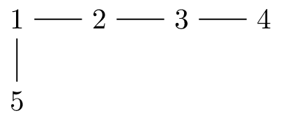
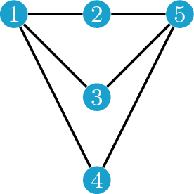
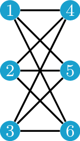
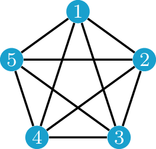
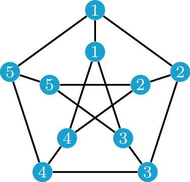

# Graphs in TikZ
TikZでグラフ（ネットワーク）を簡単に描く

```{contents}
:depth: 1
:local:
:backlinks: none
```

## Graph記法とは
TikZの`graph`ライブラリには，グラフを簡単に描くための`\graph`がある．まずはプリアンブルで以下のようにライブラリを読み込む．
```tex
\usetikzlibrary{graphs}
```
`\graph`記法はTikZ環境内で使えるマクロで以下のように使う．
```tex
\begin{tikzpicture}
\graph{
    1 -- 2 -- 3 -- 4;
    1 -- 5;
};
\end{tikzpicture}
```
すると次のグラフができる．



`\graph`内に新しく現れた頂点には，新たにTikZの`node`が生成される．
他方，すでに現れた頂点と同じ名前には，同じ`node`が使いまわされる．
上では，`1`は1行目で生成されるが，2行目では1行目で生成された`1`が使いまわされている．

```{note}
graph記法の内部で`\foreach`や`\onslide`等を使うとバグることがある．あまり複雑なコードは書かないほうが良い．
```

**以下では，`tikzpicture`環境は省略する．**

## デフォルトスタイルの設定
`graph`環境のオプションでスタイルを設定できる．通常のTikZのノードやパスと同じようにスタイルの指定が可能である．

```tex
\graph[nodes={<node style>}, edges={<edge style>}]{...};
```

グラフごとにいちいち指定するのは面倒なので，`graphs/every graph/.style`を用いて，デフォルトスタイルを以下のように指定すると便利である．

```tex
\tikzset{mynodes/.style={circle,white,fill=UniBlue!90,text width=.8em,inner sep=0pt,text centered,font=\footnotesize}} % 頂点のスタイル
\tikzset{myedges/.style={thick}} % 枝のスタイル
\tikzset{graphs/every graph/.style={nodes={mynodes}, edges={myedges}}} % グラフのデフォルトスタイル
\tikzset{graphs/digraph/.style={edges={myedges,-latex}}} % 有向グラフのデフォルトスタイル
```

上のスタイルを用いると，先の例のグラフは以下のようになる．


デフォルトでは頂点名がそのまま頂点内テキストとして描画される．
以下のオプションを追加で`every graph./style`に指定するとこれを変更できる．

| オプション | 説明 |
|-----------|------------|
| `empty nodes` | 頂点内テキストを描画しない |
| `math nodes`  | 頂点内テキストを数式モード`$...$`として解釈 |


## Graph記法いろいろ
`\graph`内では色々な略記法が使えるので，通常のTikZより楽である．

### まとめて枝をひく
`{}`で頂点をグループ化すると，まとめて枝をひくことができる．
```tex
\graph{
    1 -- {2, 3, 4} -- 5;
};
```



2つのグループ間に枝をひくこともできる．`complete bipartite`をつけると，その上の完全二部グラフが作れる．
```tex
\graph{
    {1, 2, 3} --[complete bipartite] {4, 5, 6};
};
```



### 既存のTikZノードを使う
`\graph`外で定義したTikZのノードを使うには，その座標を書く．
以下は，すでに定義されたTikZノード`a`と新しいグラフ頂点のノード`1`に枝を引く例．
```tex
\graph{
    (a) -- 1;
};
```


### 頂点に文字を書く
`as={}`を書くことで，頂点内のテキストを指定できる．
```tex
\graph{
    1[as={$s$}];
}
```


## Graphs.standardライブラリとグラフマクロ
完全グラフやサイクルグラフなどのよく使うグラフは，グラフマクロとしてTikZ内に登録されている．これらを使うためには，`graphs.standard`を読み込む．

```tex
\usetikzlibrary{graphs.standard}
```

例えば，$n$頂点完全グラフ($K_n$)は`K_n`で作れる．`n=`で頂点数を指定できる．
```tex
\graph{subgraph K_n[n=5, clockwise]};
```




ここで，`clockwise`は頂点を時計回りに配置するオプションである．
デフォルトでは，ノード名は`1`, `2`, ..., `n`になる．

$m$頂点と$n$頂点をもつ完全二部グラフ($K_{nm}$)は`K_nm`を使う．
```tex
\graph{subgraph K_nm[n=5, m=3]};
```
デフォルトでは左側ノード名が`V 1`, `V 2`, ..., `V n`となり，右側ノード名が`W 1`, `W 2`, ..., `W m`となる．


以下が`graphs.standard`ライブラリに定義されているグラフ一覧である．

| グラフ | マクロ名 | 補足 |
|-----------|------------| ------------|
| 完全グラフ($C_n$) | `K_n` | |
| 完全二部グラフ($K_{nm}$) | `K_nm` | |
| サイクルグラフ($C_n$) | `C_n` | |
| パスグラフ($P_n$) | `P_n` | |
| 独立集合 | `I_n` | `K_n`の枝なし版 |
| 二部独立集合 | `I_nm` | `K_nm`の枝なし版 |
| グリッドグラフ | `Grid_n` |  |

### 自作グラフマクロを登録する
デフォルトのグラフマクロは種類が少ないので，よく使うグラフは自作グラフマクロとして登録しておくと便利である．TikZのスタイル同様に
`\tikzgraphset{declare={<グラフ名>}{<中身>}}`
で登録できる．以下はPetersenグラフを自作マクロ`Petersen`として登録する例である．参考: [Petersen graph with new tikz graph library](https://tex.stackexchange.com/questions/207953/petersen-graph-with-new-tikz-graph-library)

```tex
\tikzgraphsset{declare={Petersen}{%
    subgraph C_n [n=5, name=A, radius=1.5cm]; 
    subgraph I_n [n=5, name=B, radius=.8cm];
    \foreach \i [evaluate={\j=int(mod(\i+2,5)+1);}] in {1,...,5}{
        A \i -- B \i;
        B \i -- B \j;
}}}
```

登録後は以下のようにして簡単に呼び出せる.
```tex
\graph[clockwise]{Petersen};
```




## 配置の調整

### 手動で座標を指定
デフォルトでは，`grid placement`という配置規則に従ってノードが配置される．これを無効にし，自分で座標を指定したい場合は，`no placement`を利用し，頂点ごとに`at={}`を用いて座標を指定する．`at`を指定しない頂点は原点に配置される．
```tex
\graph[no placement]{
    a;
    b[at={(1,0)}];
}
```


## Tips
### 枝を消す
`\graph`に`simple`オプションを指定すると，同じ頂点対間に枝が複数回ひかれた場合には，**最後にひいた枝のみが残る**．これを応用すると，後から枝を消すことができる．例えば，$K_5$から1本だけ枝を削除したグラフは，いちいち枝を指定することなく以下のように簡潔に書ける．

```tex
\graph[simple]{
    subgraph K_n[n=5, clockwise];
    3 -!- 5;
};
```

`-!-`は空の枝をひく記法である．`simple`がない場合は，`-!-`は何もしない．

### 枝を細分する
枝の細分(subdivision)も簡単に作れる．
```tex
\newcommand{\subdivision}[3]{%
    \path (#1) -- (#2)
    \foreach \i in {1,...,#3} {
        node[mynodes, text width=.5em, pos=\i/(#3+1)] {}
    };
}
```
使い方は，`\subdivision{<始点>}{<終点>}{<細分した枝に追加される頂点数>}`である．始点と終点にはノード名を指定する．


例: $K_5$の細分は以下のように作れる．[Kuratowskiの定理](https://en.wikipedia.org/wiki/Kuratowski%27s_theorem)を紹介するときに便利だと思う．
```tex
\graph{subgraph K_n[n=5,clockwise,radius=2cm]};
\subdivision{1}{2}{2};
\subdivision{2}{3}{4};
\subdivision{3}{4}{2};
\subdivision{4}{5}{1};
\subdivision{5}{1}{1};
\subdivision{5}{2}{3};
```


